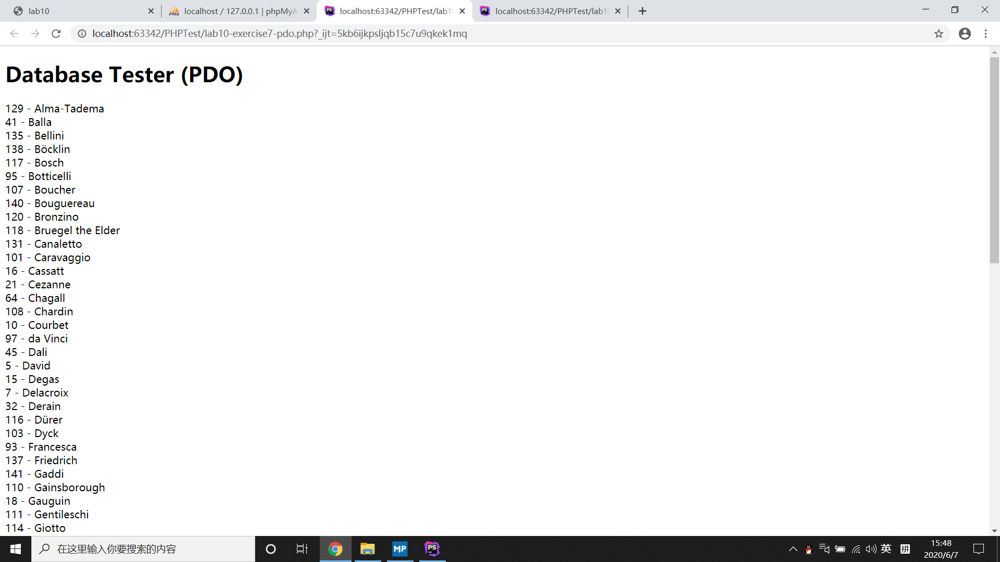
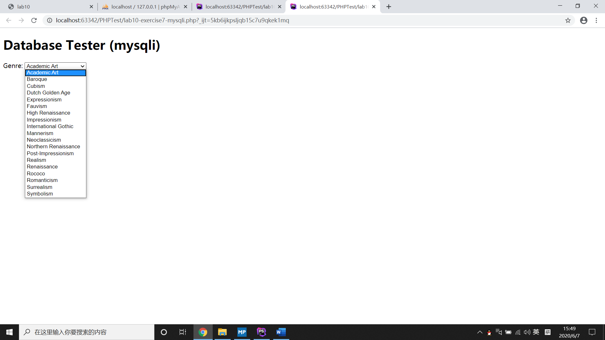
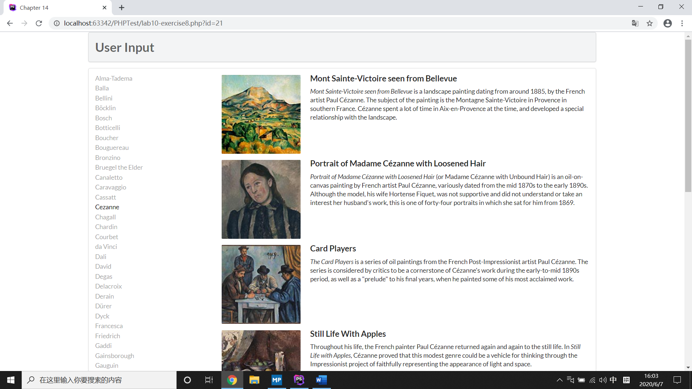
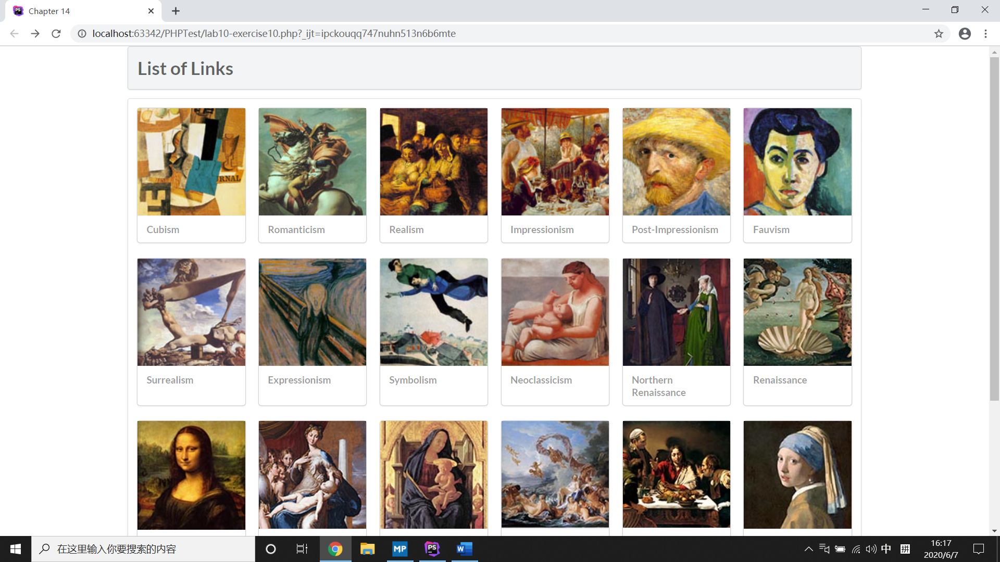

#Lab10实验文档
> 19302010009 钱麒丹
## Exercise7
### 屏幕截图

首先在config.php中设置完毕连接字符串、用户名和密码。
###PDO
1. 通过config.php中的常量数据连接到相对应的数据库，并设定处理错误的模式。
2. 执行SQL语句对数据库进行查找，并得到结果的集合。
3. 使用fetch()方法遍历结果集合中的记录并输出相应结果至html文档中。
4. 将连接对象设置为null以释放内存并且关闭连接。
###mysqli
1. 通过config.php中的常量数据连接到相对应的数据库，并检查连接是否成功，如果不成功则打印错误信息并退出当前脚本。
2. 执行SQL语句对数据库进行查找，并得到结果的集合。
3. 通过mysqli_fetch_assoc()函数遍历结果集合中的记录并输出相应结果至html文档中。
4. 通过mysqli_free_result()函数释放内存;
## Exercise8
### 屏幕截图

通过config.php中的常量数据连接到相对应的数据库。
### outputArtists()
通过PDO对artists表进行检索，并得到通过LastName排序的30个artists的数据记录集合，然后遍历集合并通过记录的ArtistID设置对应超链接的内容以及目标，同时根据当前图片对应的ArtistID设定超连接是否active，并将其写入html文档，最后释放内存并关闭连接。
### outputPaintings()
通过PDO对paintings表进行检索，得到当前ArtistID对应painting的数据记录，然后遍历记录并将其传入outputSinglePainting()函数，最后释放内存并关闭连接。
### outputSinglePainting()
通过被传入的数据记录$row，根据%row中数据的值设置外部块元素并插入相应的img元素，将其写入html文档，以输出对应painting的图片、名字与介绍。
## Exercise9
### SQL语句执行过程
1. 客户端将SQL语句发给服务器端执行。
2. 服务器端进行SQL语句的解析，为语句中的绑定变量赋值，并执行最佳的查询计划。
3. 服务器端执行SQL语句，并将查询到的数据结果返回给用户端进程。
### Prepared Statement的优势
1. 增加了代码的可读性和可维护性。
2. 对SQL语句进行了预编译，避免数据库频繁编译SQL造成缓冲区的溢出，性能更优。
3. 消除SQL注入的安全漏洞，极大提高了安全性。
## Exercise10
### 屏幕截图

### outputGenres()
通过PDO对genres表进行检索，并得到通过GenreID排序的genres的数据记录集合，遍历数据记录并将其传入outputSingleGenre()方法，最后释放内存并关闭连接。
### outputSingleGenre()
通过被传入的数据记录$row，设置外部块元素，并根据%row中GenreId的值插入相应的img元素，其中超链接设置部分由constructGenreLink()完成，最后将其写入html文档。
### constructGenreLink()
根据被传入的$id值，在图片与文本外层嵌套相对应目标的超链接。