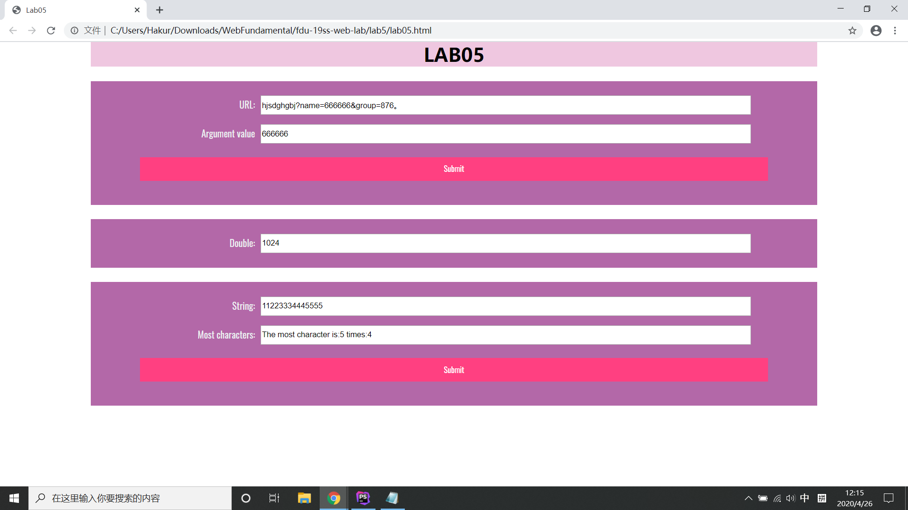

# 设计文档
> 19302010009 钱麒丹

## 网页运行截图

## URL
运用了字符串的**indexOf**方法来获得字符的位置，并且利用**substring**方法来截取URL来获得其中的name字段。

## 时间函数
通过**setInterva**l方法来设置间隔执行语句，并且使用**Date**对象来获得当前的时间，以此来使间隔执行语句在分钟变化过后停止。**count**变量用于语句执行的计数，满了便停止。

## 最大相同字符个数
先统计原字符串中的所有字符的出现个数，并存储入**二维数组**，再在所有字符的出现个数中**选出最大值**以及对应的字符。
