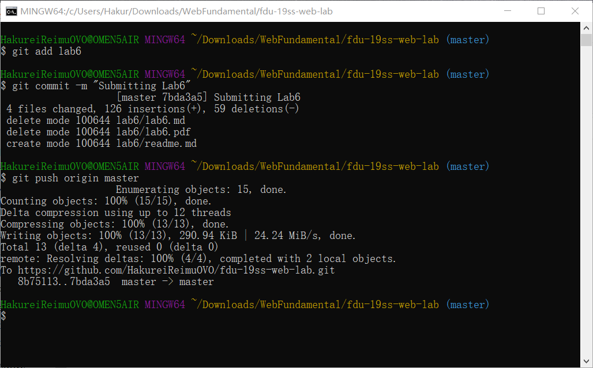
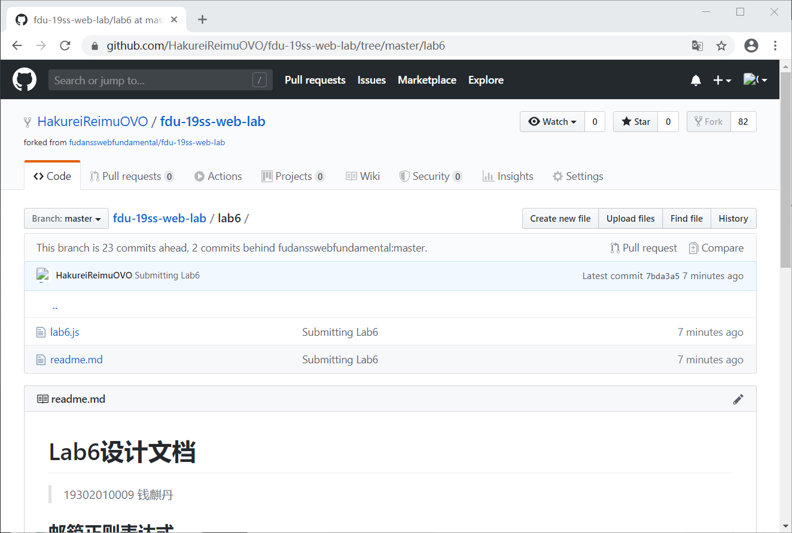

# Lab6设计文档
> 19302010009 钱麒丹
## 网页Git截图

## 邮箱正则表达式
我使用的正则表达式为/^[\w-_]+@[\w-_]+(\.[\w-_]+)+$/。  
邮箱规定可以使用数字字母下划线以及减号，[/w-_]用于匹配邮箱的合法字符。  
[\w-_]+用于匹配邮箱的账号；@用于匹配邮箱的分隔符；[\w-_]+(\.[\w-_]+)+则用于匹配邮箱的域名，其中(\.[\w-_]+)+适用于匹配不同长度的域名。
## 重复单词正则表达式
我使用的正则表达式为/\b([A-Z]+)\s+\1\b/ig。  
其中\b用于确保匹配的字段是两个单词，其左边和右边没有连续的单词字段。由于表达式末尾有i使得表达式对于大小写不敏感，因此([A-Z]+)将用于匹配英文单词，( )用于记忆匹配到的第一个单词。\s+匹配单词中间的至少一个空格。\1用于匹配先前记忆的第一个单词。表达式末尾的g表示全局匹配，匹配并找出所有重复的单词。
## Array Set Map理解
*Array*是数组，成员值内容可以相同，**用于存储成组出现的数据。**  
*Set*类似于数组，但是与Array不同处在于，其成员值都是唯一的，**用于存储有不可重复要求的成组数据。**  
*Map*则类似于2&#42;n的二维数组，是键值对的有序列表，一个key对应一个value，**用于存储一一对应的数据。**
## 继承不同方式的理解
**原型链继承**是将子类的原型设为父类的实例。  
**借用父类构造函数**是在子类构造函数内部调用父类构造函数，将子类构造函数中的this对象传入父类构造函数。  
**组合继承**是复合使用上述两种继承方式的继承方法，因此可以规避彼此的缺点。  
**原型式继承**(Object.create())基于已有的父类对象创建子类对象，本质上是父类对象的浅复制。